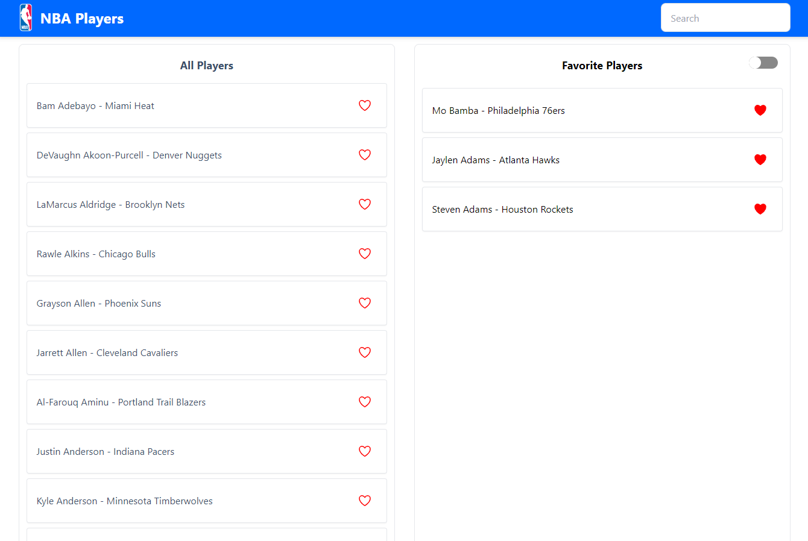
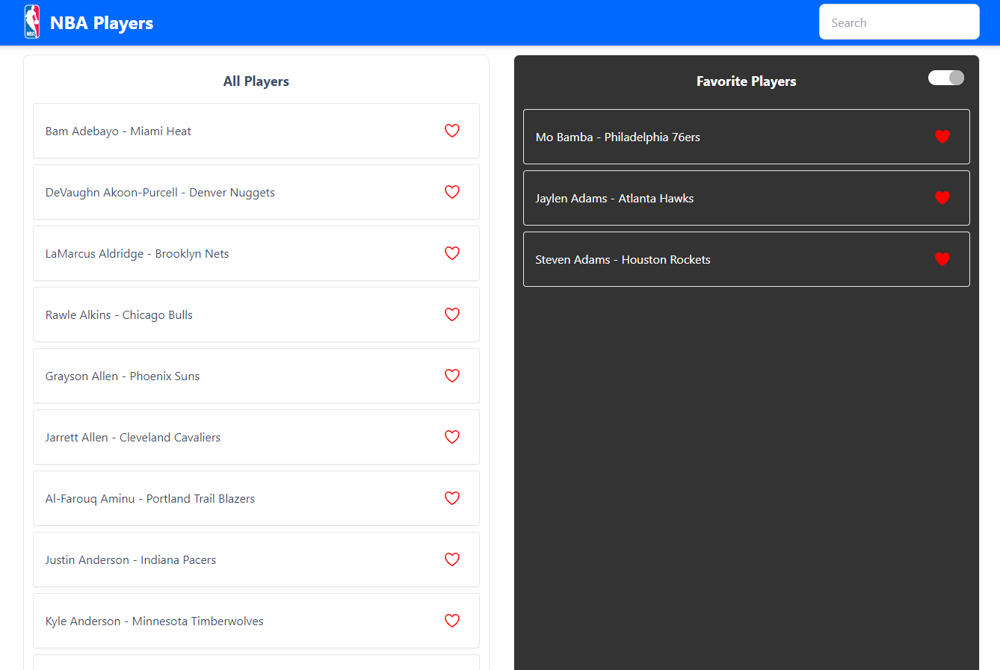
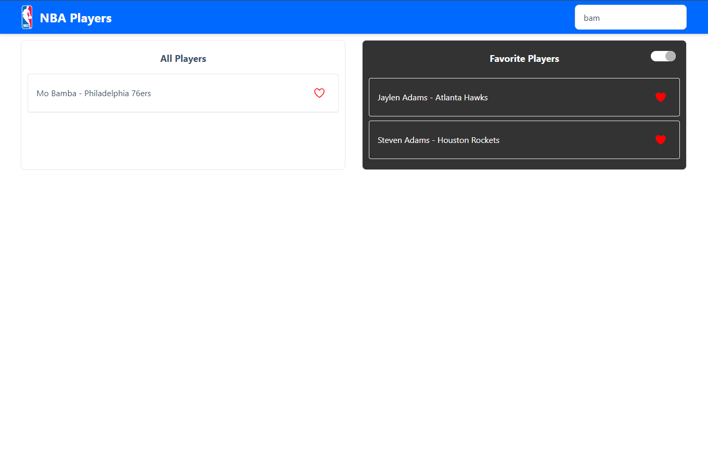
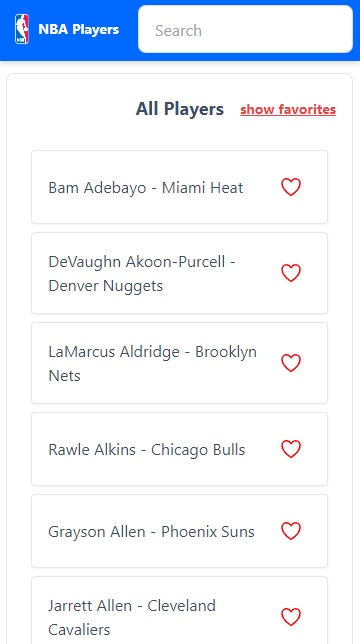
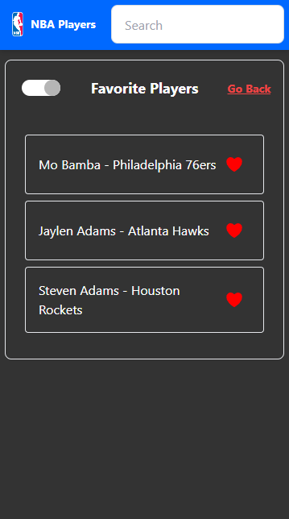
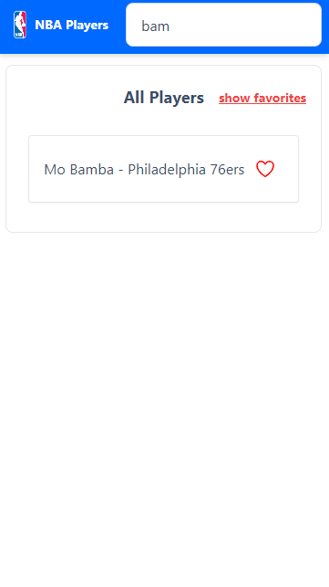

# NBA Players

NBA Players is a React-based web application that leverages the [BallDontLie API](https://www.balldontlie.io) to display NBA player statistics and allows users to search for players, mark their favorites, and manage these preferences in a visually appealing interface.

## Features

- **Player Search**: Search for NBA players using the BallDontLie API.
- **Favorite Players**: Users can mark players as favorites and manage this list.
- **Responsive Design**: Optimized for both desktop and mobile view.
- **Infinite Scrolling**: Load more players dynamically as you scroll.
- **Dark Mode Toggle**: Users can switch between light and dark themes in the favorites section.

## Installation

To get started with NBA Players, follow these steps:

1. **Clone the Repository**

   ```bash
   git clone https://github.com/obrm/nba-playes.git
   cd NBA Players
   ```

2. **Install Dependencies**

   ```bash
   npm install
   ```

3. **Environment Variables**

   Create a `.env` file at the root of your project and add the following:

   ```plaintext
   VITE_NBA_API_KEY=your_api_key_here
   VITE_API_URL=https://api.balldontlie.io/v1
   ```

   Replace `your_api_key_here` with your actual BallDontLie API key.

4. **Run the Application**

   ```bash
   npm run dev
   ```

## Usage

Navigate through the application to search for NBA players, add or remove them from your favorites, and toggle between the light and dark themes in the favorites section. Use the responsive layout to access the app on any device.

## Screenshots

### Main Layout Desktop


### Main Dark Theme Layout Desktop


### Main Layout With Search Desktop


### Main Layout Mobile


### Favorites Page Mobile


### Main Layout With Search Mobile



## Dependencies

- React
- Axios for API requests
- Lodash for utility functions
- React Icons for scalable icons
- React Infinite Scroll Component for infinite scroll
- React Switch for toggling between themes
- React Toastify for alerts
- DaisyUI for UI components
- Tailwind CSS for DaisyUI

## Contributing

Contributions are welcome! Please fork the repository and submit a pull request with your updates.

## License

`NBA Players` is released under the MIT License. 
